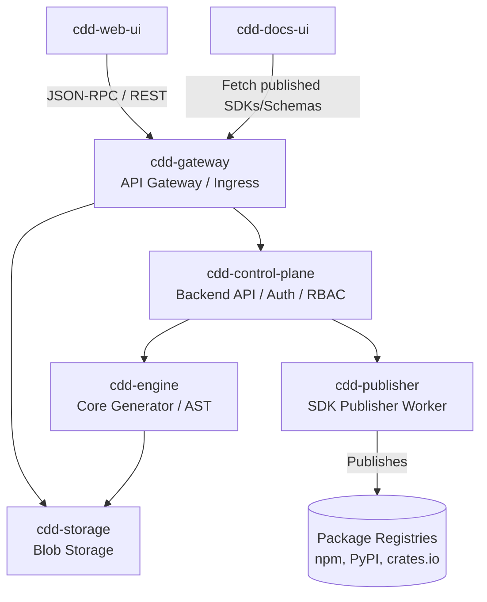

# Architecture: `cdd-control-plane`

`cdd-control-plane` acts as the primary "Control Plane" of the distributed CDD ecosystem.

## Components
1. **API Layer (`actix-web` / REST):** Exposes JSON endpoints for `cdd-web-ui` and potentially proxy requests from `cdd-gateway`.
2. **Data Layer (`diesel`):**
    - Connects to the PostgreSQL database.
    - Manages schema migrations.
    - Contains entity models (User, Organization, Repository, SDK Release, Audit Event).
3. **Auth/Security Layer:**
    - Verifies upstream session JWTs or provisions them.
    - Uses Argon2 for legacy password flows, but primarily relies on OAuth2.
    - Decrypts secrets (using Libsodium) only when passing them securely to internal workers like `cdd-publisher`.

## Integration points

- **`cdd-web-ui`:** Front-end dashboard accesses `cdd-control-plane` (via `cdd-gateway`) to fetch org/repo lists and manage release settings.
- **`cdd-publisher`:** `cdd-control-plane` queues publish events (via Redis/AMQP) that the publisher consumes.
- **`cdd-engine`:** In the future, API requests to generate code might be queued or RPC-called directly into the engine.
